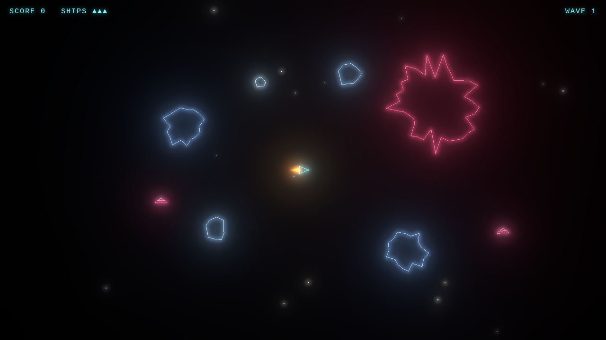
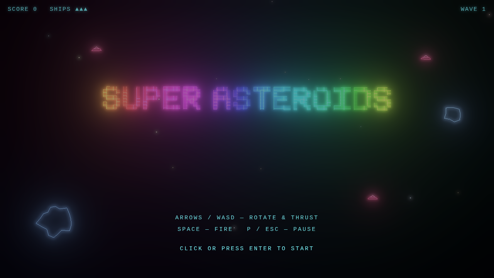

# SUPER ASTEROIDS

A neon vector-style Asteroids game built for the browser with [Three.js](https://threejs.org/) — infinite space, player-centered camera, asteroid splitting, flying saucers, power-ups, and bloom glow.

*Gameplay — the ship at the center of an infinite field, flanked by a giant super asteroid, normal rocks, and a pair of hunting saucers:*



*Start screen, with saucers already prowling the ambient world:*



## Features

- Player-centered camera over an infinite world — the ship stays centered while the universe moves around it
- Asteroids always spawn just off-screen near the player, keeping the field dense without dead space
- Asteroid hierarchy: Super → Large → Medium → Small → particle debris — supers dwarf everything else and accumulate up to three at once as waves progress
- Flying saucers with erratic sine-wave paths that aim for the player — more and more of them arrive over time, up to six at once
- Animated fire-cone engine exhaust that flickers and scales with thrust
- Power-ups: laser, multishot, shield
- Bloom post-processing for vector line glow, screen shake, and directional particle splinters
- Procedural audio: low-pass engine hum modulated by velocity, sub-bass explosions, pitch-shifted lasers

## Getting Started

```bash
npm install
npm run dev
```

Open the printed URL (default `http://localhost:5173`).

## Controls

| Key | Action |
| --- | --- |
| `←` / `→` or `A` / `D` | Rotate |
| `↑` / `↓` or `W` / `S` | Thrust |
| `Space` | Fire |
| `P` / `Esc` | Pause |
| `Enter` | Start / Restart |

## Build

```bash
npm run build
npm run preview
```

## Tech

- [Three.js](https://threejs.org/) — WebGL rendering
- [Vite](https://vite.dev/) — dev server and bundler

See [DESIGN.md](DESIGN.md) for architecture details.
